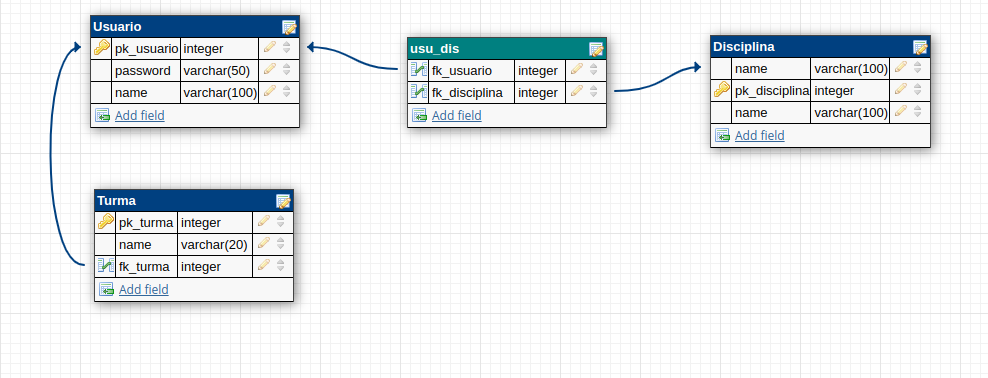
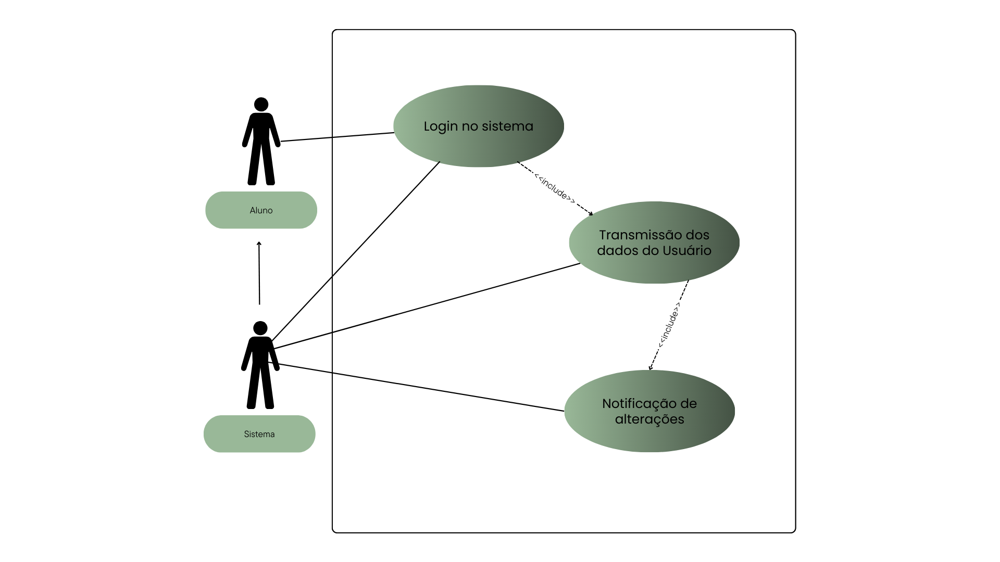

# *Zyra*

Um modelo para o desenvolvimento do Projeto Integrador do Curso de Técnico em Desenvolvimento de Sistemas para a Internet Integrado ao Ensino Médio do IFC - Campus Araquari.
Este projeto busca filtrar informações acadêmicas de alunos usando técnicas de web-scraping. Com essas informações, temos o objetivo de simplificar e automatizar o processo de verificações das seguintes informações: notas, horários, cardápio, turmas, avisos e outros certificados; usando como meio de comunicação usuário-sistema: Whatsapp e e-mail.

Professor: [Marco André Mendes](github.com/marcoandre)

Equipe:
- [Cauã](https://github.com/Caussz)
- [Giulia](https://github.com/GiuliaNobre)
- [Isadora](https://github.com/IsadoraAlcantara)
- [Luiz](https://github.com/LuizNunes06).

Links do projeto:
-   [Documentação (esse documento)](github.com/marcoandre/pi-modelo)
-   Backend: [Repositório](https://github.com/Caussz/PI_MicroService_NodeJs) e [Publicação](https://pi-backend.herokuapp.com/)
-   Frontend: [Repositório](https://github.com/Caussz/PI-FrontEnd-VueJs) e [Publicação](https://pi-frontend.herokuapp.com/)

# 1. Desenvolvimento

**Gestão de Informações Acadêmicas com o Zyra**

Em uma instituição de grande porte, onde o volume de dados e a diversidade de atividades acadêmicas são elevados, muitos alunos enfrentam dificuldades para acessar informações importantes, como notas, horários de aula e comunicados. Para solucionar esse desafio, é essencial um sistema que centralize a gestão de informações acadêmicas, permitindo que os alunos acessem seus dados de forma simples e automatizada.
O sistema deve ser capaz de enviar notificações automáticas, garantindo que os alunos sejam informados em tempo real sobre alterações acadêmicas, como mudanças nas notas, novas atividades e comunicados institucionais.
Além disso, é fundamental que o sistema forneça relatórios detalhados sobre o andamento das atividades acadêmicas, incluindo status de entrega de trabalhos e desempenho geral dos estudantes, oferecendo suporte à gestão eficiente e à tomada de decisões estratégicas pela instituição.
O Zyra é a solução ideal para atender às demandas de instituições de grande porte, promovendo organização, acessibilidade e eficiência em larga escala.

# 2. Situação Problema

-   **Introdução**: O Instituto Federal (IF) é uma instituição de grande porte com destaque nacional na oferta de ensino técnico e superior em diversas áreas do conhecimento. Com milhares de alunos matriculados e uma equipe composta por professores, técnicos administrativos e colaboradores, o IF tem como missão promover a educação pública, gratuita e de qualidade. Apesar de seu papel estratégico na formação de profissionais, o IF enfrenta desafios significativos na gestão de informações acadêmicas devido ao grande volume de dados gerados diariamente e às limitações das ferramentas atualmente em uso.
  
-   **Situação-problema**: Atualmente, o Instituto Federal utiliza o sistema SIGAA (Sistema Integrado de Gestão de Atividades Acadêmicas) para gerenciar informações acadêmicas e administrativas. Apesar de sua robustez, o SIGAA apresenta limitações na usabilidade e acessibilidade, o que dificulta a experiência de alunos, professores e equipes administrativas.

Os alunos enfrentam as seguintes dificuldades:

Acesso demorado a informações como notas, horários de aula e comunicados.
Falta de notificações em tempo real sobre atualizações importantes, como novas atividades ou alterações em horários.
Dificuldade em encontrar dados específicos, como detalhes sobre turmas e professores.
Por parte da administração, a ausência de relatórios simples e personalizados sobre o andamento acadêmico e administrativo compromete a tomada de decisões. Problemas como atrasos na entrega de trabalhos, baixa participação em atividades ou falhas na comunicação institucional não são detectados de forma eficiente.
Além disso, a fragmentação dos canais de comunicação torna o contato com os alunos menos eficaz. Muitos estudantes utilizam meios como WhatsApp e e-mail diariamente, mas o SIGAA não possui integração direta com essas plataformas, o que resulta em informações perdidas ou ignoradas.

-   **Conclusão**: A situação atual impacta negativamente a organização e eficiência do Instituto Federal, além de prejudicar a experiência dos alunos. O sistema Zyra surge como uma solução inovadora para esses problemas. Com funcionalidades de web scraping, notificações automáticas via WhatsApp e e-mail, e integração com os dados do SIGAA, o Zyra facilitará o acesso às informações e proporcionará relatórios detalhados que apoiarão a gestão estratégica da instituição. A implementação do Zyra promete transformar o ambiente acadêmico, modernizando os processos e aprimorando a comunicação entre alunos e administração.

# 3. Descrição da proposta

Para resolver os desafios levantados, o sistema Zyra será desenvolvido com o foco em centralizar e simplificar o acesso às informações acadêmicas para alunos e gestores do Instituto Federal (IF). O objetivo principal do Zyra é permitir que os usuários tenham acesso fácil e rápido a dados acadêmicos, como notas, horários de aula, comunicados e avisos, além de receber notificações automáticas em tempo real via WhatsApp e e-mail.

**Alguns pontos importantes a se destacar são:**

-   **Qual o foco de ação do software** O Zyra é um sistema de filtragem e busca de dados acadêmicos que utiliza técnicas de web scraping para extrair informações diretamente do SIGAA. Ele processará e organizará esses dados para disponibilizá-los de forma acessível e integrada aos meios de comunicação mais utilizados pelos alunos.
-   **Os níveis de usuário do sistema** Alunos: poderão visualizar suas informações acadêmicas pessoais, como notas, horários de aula, atividades e comunicados. Também receberão notificações automáticas sempre que houver atualizações nos dados cadastrados.
-   **O que poderá ser feito no software** Consulta e visualização de dados: Os alunos poderão acessar informações importantes como notas, horários, avisos, comunicados e detalhes das turmas.
Notificações automáticas: Envio de mensagens personalizadas via WhatsApp e e-mail para informar atualizações, como novas atividades ou alterações em horários.
Relatórios personalizados: Os gestores terão acesso a relatórios sobre o desempenho acadêmico, participação em atividades e status de tarefas, para apoiar na tomada de decisões estratégicas.
O Zyra será uma solução eficiente, moderna e acessível, desenvolvida com foco na usabilidade e na integração com ferramentas de comunicação amplamente utilizadas. O sistema promete transformar a experiência acadêmica ao simplificar processos e fortalecer a comunicação entre o IF e seus alunos.

# 4. Modelagem de Dados

# 5. Regras de negócio

- **RN01 – Autenticação do SIGAA:** O sistema só pode acessar e extrair dados acadêmicos do SIGAA após o login do usuário e com a devida autenticação das credenciais do SIGAA.
- **RN02 – Preferências de Notificação:** O usuário deve definir suas preferências de notificação (WhatsApp, e-mail ou outro front-end) para receber atualizações sobre notas ou atividades acadêmicas.
- **RN03 – Notificações Únicas:** O sistema deve enviar notificações sobre alterações nas notas ou atividades acadêmicas somente após uma modificação real nos dados armazenados. O sistema não pode enviar notificações repetidas para a mesma alteração.
- **RN04 – Armazenamento Seguro de Dados Acadêmicos:** Todos os dados relacionados ao desempenho acadêmico dos alunos, como notas e atividades, devem ser armazenados de forma segura e podem ser acessados para consulta ou envio de notificações.

# 6. Requisitos funcionais

**Entradas:**

**R.F. 01 - Tela de Login:** O sistema terá apenas uma tela de login onde o usuário irá inserir suas credenciais do SIGAA para autenticação e acesso aos dados acadêmicos.
**Dados necessários:** login, senha.
**Usuários:** todos os níveis de usuário.

**R.F. 02 - Preferências de Notificação:** O sistema permite que o usuário defina suas preferências de notificação (WhatsApp, e-mail ou outro front-end) para receber atualizações sobre as notas ou atividades acadêmicas.
**Dados necessários:** canal de comunicação escolhido (WhatsApp, e-mail ou outro), dados acadêmicos a serem enviados.
**Usuários:** alunos cadastrados.

**Processamento:**

**R.F. 03 - Autenticação do Usuário:** O sistema autentica o usuário com base nas credenciais fornecidas, verificando se as informações estão corretas e, caso positivo, direcionando para a página principal do perfil de acesso.
**Dados necessários:** login, senha, nível de permissão.
**Usuários:** todos os níveis de usuário.

**R.F. 04 - Modificação e Notificação:** O sistema verifica se há alterações nas notas ou atividades acadêmicas e envia notificações para os alunos cadastrados sobre essas modificações.
**Dados necessários:** dados acadêmicos (notas, atividades), informações sobre alterações, preferências de notificação.
**Usuários:** alunos cadastrados, com preferências de notificação configuradas.

**Saída:**

**R.F. 05 - Transmissão de Dados:** O sistema deve transmitir os dados do usuário via WhatsApp, e-mail ou impresso em outro front-end, conforme a preferência definida pelo usuário.
**Dados necessários:** dados acadêmicos, dados de contato do usuário, canal de comunicação escolhido.
**Usuários:** alunos cadastrados no sistema, com preferências definidas.

# 7. Requisitos não funcionais

- **R.N.F. 01 - Web Scraping:** o sistema deverá ser homologado para os navegadores Google Chrome e Mozilla Firefox.
- **R.N.F. 02 - Comunicação via WhatsApp:** A comunicação com o WhatsApp será realizada utilizando a biblioteca de terceiros Baileys.
- **R.N.F. 03- Comunicação via E-mail:** A comunicação via e-mail será realizada utilizando a biblioteca Django-Mail.
- **R.N.F. 04 - Front-end PWA:** O Front-end deverá ser compatível com PWA (Progressive Web App) e desenvolvido com Vue.js.
- **R.N.F. 05 -  Banco de Dados:**  As informações serão armazenadas em um banco de dados PostgreSQL.
- **R.N.F. 06 - Microserviço:** O micro serviço será desenvolvido utilizando Node.js.
- **R.N.F. 07-  Tecnologias de Apoio:** Será utilizado o conjunto de tecnologias Cheerio, Puppeteer, Pino, Cors e Helmet para o processamento, segurança e log de dados.

# 8. Diagrama de Caso de Uso

